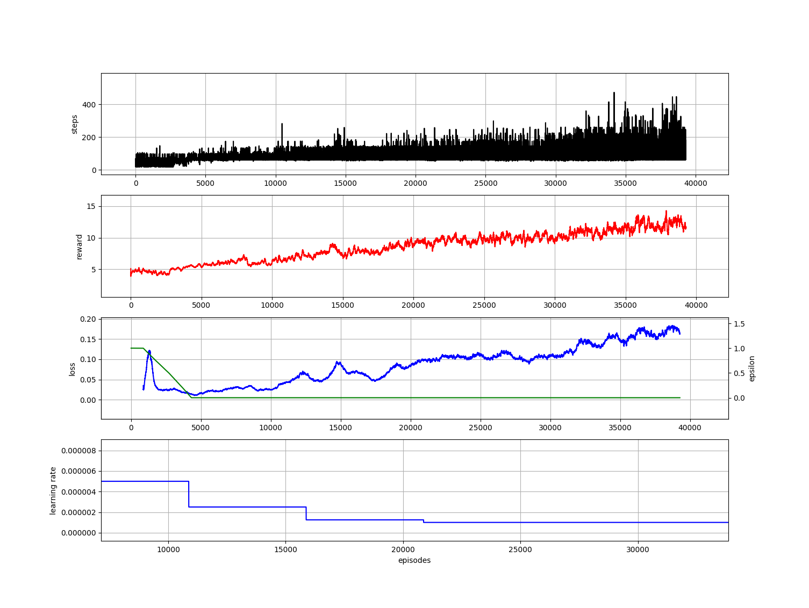

# FlappyBird with DQN
Tensorflow implementation of FlappyBird using Reinforcement Learning, DQN


longer version: [DQN for flappy bird](https://www.youtube.com/watch?v=SA5S9CT22Co)

## Prerequisites
-   Tensorflow 1.0 or higher
-   python-pygame

## Getting Started
### Installation
-   Install tensorflow from https://www.tensorflow.org/install/
-   Clone this repo:
```bash
git clone https://github.com/codeslake/flappybird_DQN.git
cd flappybird_DQN
```
-   Install python-pygame
```bash
sudo apt-get install python-pygame
```
-   There is no need to install gym and gym-ple. Actually, one needs to use what are uploaded.<br />
    There are some changes in gym (related to wrapper.monitor) and gym-ple (related retreiving info) 

## Training and Test Details
-   you need to specify directories for checkpoint and buffer saving directory in config.py
-   To train a model,  
```bash
python main.py --is_train True
```
-   To test the model,
```bash
python main.py --is_train False
```
-   To render and to show the plots (plot will not work while testing), add 
```bash
python main.py --is_Train True --render True --plot True
```

## Experiments


## License ##
This software is being made available under the terms in the [LICENSE](LICENSE) file.

Any exemptions to these terms requires a license from the Pohang University of Science and Technology.

## About Coupe Project ##
Project ‘COUPE’ aims to develop software that evaluates and improves the quality of images and videos based on big visual data. To achieve the goal, we extract sharpness, color, composition features from images and develop technologies for restoring and improving by using it. In addition, personalization technology through user preference analysis is under study.  
    
Please checkout out other Coupe repositories in our [Posgraph](https://github.com/posgraph) github organization.

## Useful Links ##
* [Coupe Library](http://coupe.postech.ac.kr/)
* [POSTECH CG Lab.](http://cg.postech.ac.kr/)
